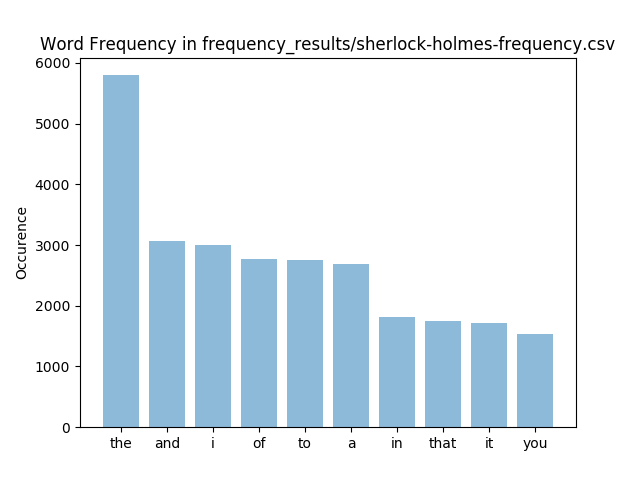

# Word Frequency Analyzer

This is a mini-project that I always wanted to spend a bit of time to do.
On one of Vsauce's amazing videos, I came across a [concept called Zipf's Law](https://www.youtube.com/watch?v=fCn8zs912OE&t=236s&ab_channel=Vsauce) which is a natural language phenomenon seen in many languages.

It goes a little bit like this. Zipf's Law claims that in a sufficiently long string of meaningful words (not random sequence of words), distribution of a particular word is ivnersely related to its ranking.

For instance, if we consider "The", English's most common word, to have a distribution of 1, then the second most frequent word, "Be", will have a distribution of 1/2 or 0.5. There seems to be no definitive explanation for why this is the case, but Zipf's Law has applications outside of our languages. Empirical studies have found that Zipf's Law can accurately predict the distribution of population among the largest cities in America.

I made this project to simply test this phenomenon using texts of different length from different time periods and I was thoroughly blown away by how apparent Zipf's Law is in some of my trials.



Take this analysis of "The Adventures of Sherlock Holmes" by Arthur Conan Doyle. "The" happened to be the most frequent word which is expected. We will consider the height of "The" to be 1. Then words "and", "I", "of", "to", and "a" competed for the second spot. Notice here that although there are some variations, height of those 5 words are almost half of that of "The." Then follows the third spots, "in", "that", "it", and "you" which are all about 1/3rd of "The."

SO COOL!!!

Anyways, if you're interested in investigating this yourself, you're welcome to use the code from this repo although since it's such a short project, it might be a good practice if you just code it yourself.

## Installation
Not much. You'll just need to have matplotlib and numpy installed.

## Usage
Download your favorite text, and then run the following command!
```python
>>> frequencies = extract_frequencies("./text_files/sherlock-holmes.txt")
>>> dump(frequencies, "frequencies.csv")
>>> build_histogram("frequencies.csv", "frequencies", 10)
```

extract_frequencies() returns a dictionary that contains word, frequency pairs
dump() creates a csv file from the dictionary
build_histogram() builds a histogram from the csv file. If you specify the outputfilename (2nd argument) then the function will automatically saves the histogram in png format. Number of histogram entry is set to 10, so it will only show the top ten most frequent word. I don't recommend playing around with that number because the words will start to overlap on the graph.